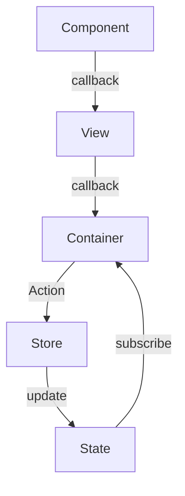

## HackaTUM 2025
### Overview
- Our app helps WGs manage their communal life by tracking expenses and keeping an organized view of pantry items
- No more confusion over who owes what or when groceries are running low — everything is in one place.

### Features
- Expense Tracking
  - Log shared expenses, split costs automatically, and see who owes what.

- Pantry Management
  - Keep track of items in the kitchen, set reminders for low-stock items, and avoid unnecessary shopping trips.

### TechStack
- Frontend: `Kotlin Multi Platform (KMP)`
- Backend: `Kotlin Ktor`
- Database: `SQLite`

### Architecture
- unidirectional dataflow similar to `redux`

